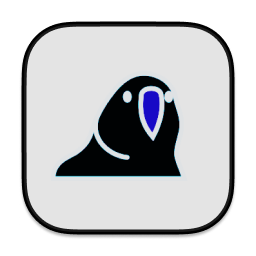

# ParrotBar

App Link: https://apps.apple.com/us/app/parrotbar/id6618137282?mt=12

ParrotBar is a macOS menu bar application that displays party parrot animations and provides minimal system and network info. 
This app features animated GIFs sourced from Cult of the Party Parrot (https://cultofthepartyparrot.com/), and offers insights 
into system uptime, disk usage, and public IP address.

## Features
Party Parrot Animations: Displays a series of animated party parrot GIFs in the menu bar.

System Information: Shows system uptime, disk usage, and battery level.

Network Information: Fetches and displays public IP address.

## GIF Source
The GIFs used in this app are sourced from Cult of the Party Parrot. You can find more about 
these GIFs and the community at Cult of the Party Parrot (https://cultofthepartyparrot.com/)

## Configuration
Configuration Files: Configuration for image offsets and other settings are managed in Offsets.json located in the project bundle.

Image Assets: GIFs and static images are stored in the Assets directory.

## Usage
Change to Random Image Set: Randomly selects a new animation 

Toggle Random Mode: Enable or disable random mode to cycle through different animations every 30 seconds

View System Information: Access the system uptime, disk usage, IP, and battery level through the menu bar icon

## License
This project is licensed under the MIT License - see the LICENSE file for details.

## Contact
For any inquiries or support, please contact murdock.mich@gmail.com or visit the app repository: https://github.com/murdockma/ParrotBar

